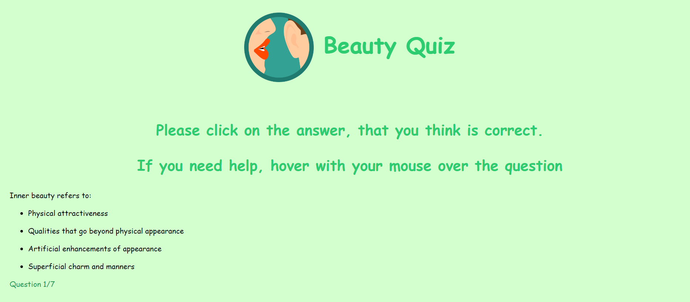
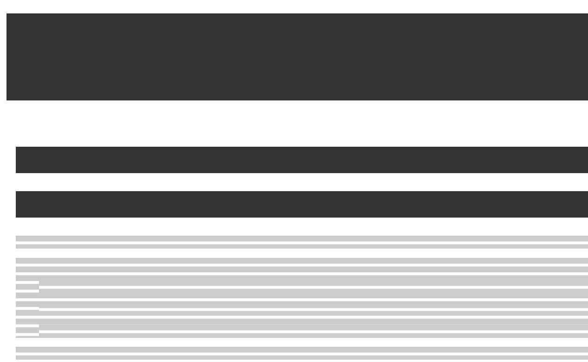
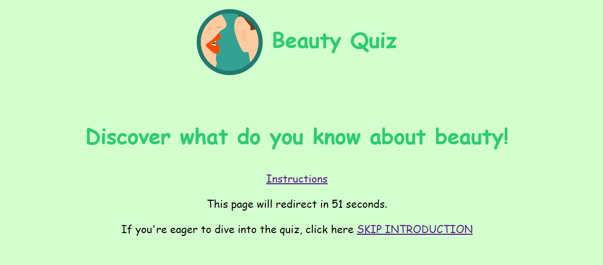
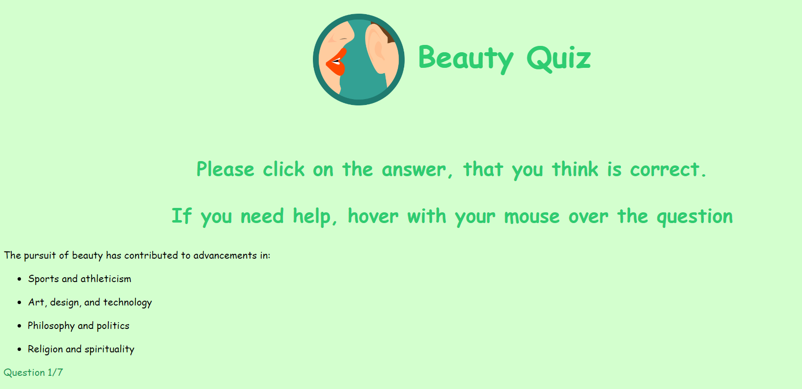
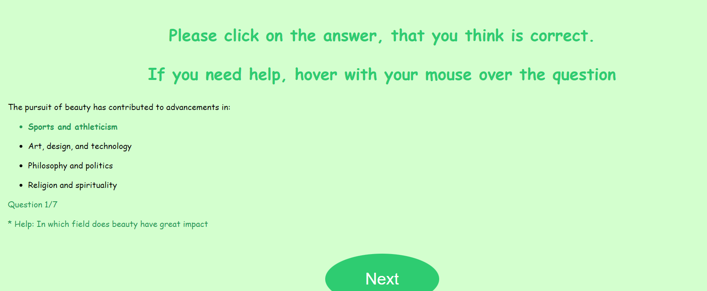
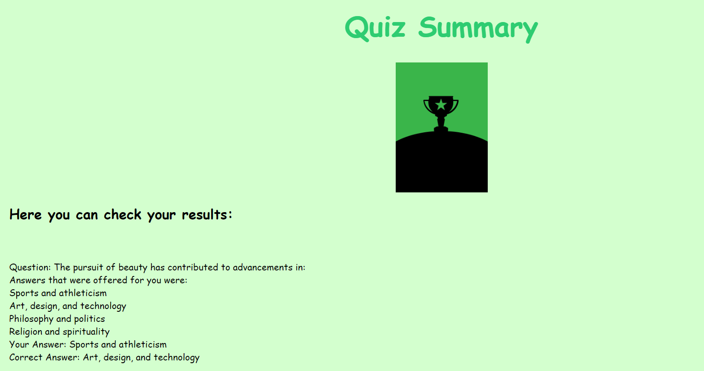
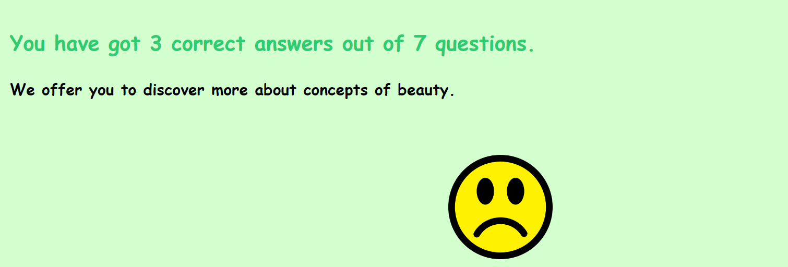

# Beauty Quiz

This is the beauty-quiz website. A website designed to test users on the concept knowledge about beauty. It will be suitable for students and people who work in beauty industry.
Visit the live site <https://oksana0020.github.io/beauty-quiz/>

# Contents

## Design

## Features

## UX

## Testing

## Sources

## Credits

## Design

The website was designed for anyone who works in beauty industry or students who learn about beauty and its concepts.

### Wireframe Design

•	The wireframe viewpoint for the website was from <https://www.wirify.com/>

### font-choices

Fonts used: 'Comic Sans MS', cursive, sans-serif;

### colour choice

•	Background Color:
•	background-color: #D3FFCE; - A light green color used for the overall background.
•	Heading Colors:
•	color: #2ECC71; - A vibrant green color used for h1 and h3 headings.
•	Button and Progress Bar Colors:
•	background-color: #C9FFD8; - A light green background color for answer buttons.
•	color: #239B56; - A darker green color for the progress bar and button hover effect.
•	Next Button Colors:
•	background-color: #2ECC71; - A vibrant green color for the next button.
•	background-color: #239B56; - A darker green color used for the next button hover effect.
•	Selected and Bold Text Colors:
•	color: #239B56; - A darker green color used for selected and bold text.
•	Help Text and Progress Bar Colors:
•	color: #239B56; - A darker green color used for help text and progress bar.

### Images

The image are taken from pixabay.com

## Features

The quiz starts with introduction page containing instructions

The quiz page containing questions appearing one by one in random order with possible answers

If the user hovers over the question text – extra help with clarifying question is available

After quiz is taken summary of all aked questions and correct answers appears on the screen

There is final message indicating overall performance. Different smile and message appears based on the number of correct results

## UX

### Site Goals

The site wants to attract people who want to check their knowledge about concepts of beauty
### Unfixed Bugs

•	None all bugs are fixed
### Validation Testing

•	HTML (W3c Validator)
•	CSS (Jigsaw)
•	JavaScript (JSHint)

### Browser Testing

Safari | ✔ |
Chrome | ✔ |
Edge | ✔ |
Firefox | ✔ |

## Deployment
This site was deployed on Github Pages:
•	From the repository you are in, first navigate to "Settings" (This is at the top of the page).
•	Then in the "Settings" you go to "Pages" (This is at the left of the newly opened page)
•	Under "Source" you then choose "Deploy from a Branch" in the drop down menu.
•	Then choose the "main" Branch, and make sure the folder "/(root)"
•	You then can click "Save"
•	The website is now being deployed (this may take a few minutes to do so be patient!)
•	To get to your new site, click in the "Code" tab of the repository.
•	Then on the right-hand side under "Environments" click on "github-pages"
•	Finally on the newly opened page, on the right-hand side, click on "View deployment"

## Sources and credits

•	The wireframe viewpoint for the website <https://www.wirify.com/>
•	Questions are taken from <https://onlineexammaker.com/kb/30-beauty-quiz-questions-and-answers/>
•	Images from <https://pixabay.com/>
•	The code for the Durstenfeld shuffle algorithm taken from stackoverflow.com
